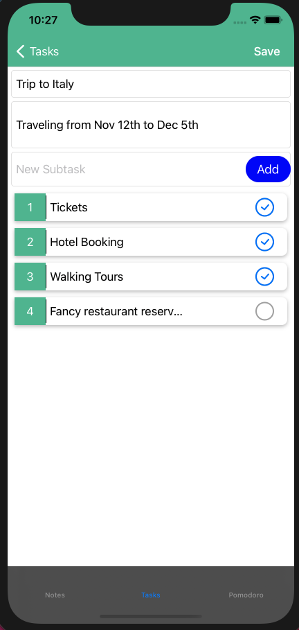

# Productiv - iOS Application 
This iOS application aids productivity by -
Helping you write and categorize your notes, 
Create tasks and keep track of subtasks at a glance,
Start pomodoro timers for focused work and short breaks 

All with a colorful, clean and simple UI. 
All information is stored locally using a Realm Database which is space efficient 

# Notes

# Task List 

# Pomodoro Timers

